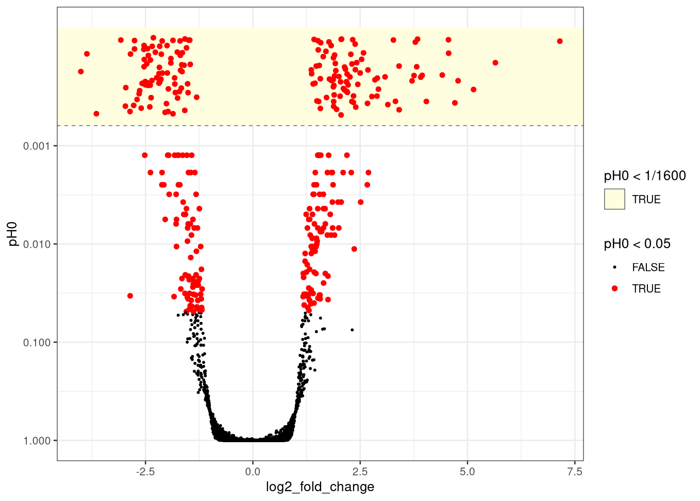

```{r setup, include = FALSE}
knitr::opts_chunk$set(
  collapse = TRUE,
  comment = "#>"
)
# Prefer Remotes-installed Suggests over Bioconductor Docker system libraries
# during R CMD build (see .github/workflows/rworkflows.yml).
for (lib in c(Sys.getenv("R_LIBS"), Sys.getenv("R_LIBS_USER"))) {
  if (nzchar(lib) && dir.exists(lib)) {
    .libPaths(c(unlist(strsplit(lib, .Platform$path.sep)), .libPaths()))
  }
}
# Fitting chunks run only when CmdStan is available (same gate as sccomp).
run_vignette <- instantiate::stan_cmdstan_exists()
```

# Overview

`brmDE` fits mixed-effect models for differential gene expression analyses, based on Bayesian regression through [brms](https://paul-buerkner.github.io/brms/). 
The typical flow is:

1. Filter lowly abundant transcripts (e.g. `tidybulk::keep_abundant()`)
2. Calculate offset/scaling, e.g. from TMM (`tidybulk::scale_abundance()`) and set `offset = log(1 / multiplier)`
3. estimate dispersion once on the full transcriptome (`estimate_dispersion_prior()`) to be used as prior for the negative binomial dispersion
4. fit one gene with `estimate_gene()` or fit the whole transcriptome with `estimate()`.
5. optionally run posterior **hypothesis** tests, **adjust** for nuisance covariates, and **plot** a gene across a factor

# Installation

## CmdStan Bayesian backend

`brmDE` uses `cmdstanr` (not on CRAN) for the default Stan backend. Three steps:

1. R package install of `brmDE`
2. R install of `cmdstanr`
3. `cmdstanr` install of CmdStan itself

```{r install, eval = FALSE}
# from this repository
devtools::install()

install.packages(
  "cmdstanr",
  repos = c("https://stan-dev.r-universe.dev/", getOption("repos"))
)

cmdstanr::check_cmdstan_toolchain(fix = TRUE)
cmdstanr::install_cmdstan()
```

## brmDE

```{r install-brmde, eval = FALSE}
remotes::install_github("stemangiola/brmDE")
```

```{r packages, message = FALSE}
library(brmDE)
library(tidybulk)
library(tidySummarizedExperiment)
tidy_print_on()
library(SummarizedExperiment)
data("airway", package = "airway")

airway <- airway |>
  mutate(
    dex = relevel(factor(dex), ref = "untrt"),
    cell = droplevels(cell)
  )
```

# One gene example

Get the TMM `multiplier` from `tidybulk::scale_abundance()`, then form the library-size offset as `log(1 / multiplier)` with `mutate()`, here using tidySummarizedExperiment for convenience.

```{r one-gene-dispersion, message = FALSE}

airway <- airway |>
  
  # Keep abundant with `dex` as factor of interest
  keep_abundant(formula_design = ~ dex) |>

  scale_abundance(method = "TMM") |>

  # The library-size offset that brmDE (abd brms) is the reciprocal of the multiplier
  mutate(offset = log(1 / multiplier)) 
```

For small sample sizes (e.g., n<30) initialising an informative dispersion prior is useful
For large sample size an informative prior is not needed

Because `estimate_dispersion_prior()` uses edgeR, which has no mixed models, pass the
fixed-effect analogue yourself: `~ dex + cell` for `~ dex + (1 | cell)`, and
`~ dex + cell + dex:cell` for `~ dex + (dex | cell)`.
  
```{r}

airway <-
  airway |> 
  estimate_dispersion_prior(formula_abundance = ~ dex + cell)
```

One rowData column per estimate, named by the corresponding arguments
(defaults shown):
  dispersion_prior_log_mean     = trended phi; pass this as the location
  dispersion_prior_log_sd       = log-scale SD from the Laplace curvature
                                  of the weighted shared log-likelihood

Let's display the abundance offset and the dispersion estimates. Here we use `tidySummarizedExperiment` for convenience

```{r}

airway |> 
  select(
    .feature , counts,  .sample, 
    TMM, multiplier,offset, 
    dispersion_prior_log_mean, dispersion_prior_log_sd
  )

```

Abundance and dispersion offset are added by brmDE in the background to compensate sample library size and gene dispersion baseline, derived from empirical Bayes.

```{r one-gene-student, message = FALSE, warning = FALSE, eval = run_vignette}
fit_t <- airway |>
  filter(.feature == "ENSG00000120129") |>
  estimate_gene(
    formula_abundance = ~ dex + (1 | cell),
    offset = "offset",
    dispersion_prior_log_mean = "dispersion_prior_log_mean",
    dispersion_prior_log_sd = "dispersion_prior_log_sd",
    family = brms::zero_inflated_negbinomial(),
    chains = 1,            # set for vignette build
    draws_warmup = 100,    # set for vignette build
    draws_sampling = 150,  # set for vignette build
    cores = 1,             # set for vignette build
    refresh = 0,           # set for vignette build
    silent = 2             # set for vignette build
  )

# Keep the dex main effect; drop the cell random intercept.
adjust_gene(fit_t, re_formula = ~0)
```

## Hypothesis testing

```{r one-gene-hypotheses, message = FALSE, warning = FALSE, eval = run_vignette}
# Is the dex effect bigger than one log2 fold change, and in which direction?
hypothesis_gene(fit_t, "dextrt")
```

by default the hypothesis is tested for effects larger than 1 log2 fold change `test_above_log2FC = 1`. 

\[
p_{H0} = P(\text{effect too small}) + P(\text{effect runs the other way}) = 1 - \max(p_{+}, p_{-}).
\]

Because `pH0` is a probability rather than a test statistic, a false discovery rate follows by averaging: the expected number of false discoveries in a set of genes is the sum of their null probabilities, so the mean `pH0` over the genes.

One limit worth keeping in mind: `pH0` is counted from posterior samling draws, so it cannot resolve below `1 / ndraws`. A `pH0` of 0 means "smaller than this fit can measure". The number of draws are few in this vignette in order to build quickly.

## Random effect differences

Normally when mixed effect models are fit, the interest is about the fix effects. However, you night be interested in how much the groups differ from the sdhared consensus (e.g. henerogeneity across cell lines in this case).

The same test applies to random intercepts. Airway has four cell lines; asking whether each cell's intercept exceeds one log2 fold change from the population mean is four hypotheses. `class = "r"` tells brms to look among the group-level coefficients.

```{r one-gene-cells, message = FALSE, warning = FALSE, eval = run_vignette}
hypothesis_gene(
  fit_t,
  c(
    "`cell[N052611,Intercept]`",
    "`cell[N061011,Intercept]`",
    "`cell[N080611,Intercept]`",
    "`cell[N61311,Intercept]`"
  ),
  class = "r"
)
```

## Posterior predictive check

Bayesian models offer a powerful quality control tool to understand whether the model is descriptively adequate for the data: the posterior predictive check. In short, the observed data is compared with predicted data given your model.

`plot_boxplot()` draws the normalised counts (removing the abundance offset) of one gene across a factor. Blue boxplots are draws from the posterior predictive distribution. If the model is descriptively adequate, the blue boxplots should overlay the black ones.

```{r one-gene-plot, message = FALSE, warning = FALSE, eval = run_vignette, fig.width = 6, fig.height = 4}
plot_boxplot(fit_t, factor = "dex", feature = "ENSG00000120129")
```

`remove_unwanted_effects = TRUE` takes the random intercepts out, or any unwanted evvect, keeping `dex` alone, and redraws the posterior predictive from that same reduced model.

```{r one-gene-plot-adjusted, message = FALSE, warning = FALSE, eval = run_vignette, fig.width = 6, fig.height = 4}
plot_boxplot(
  fit_t,
  factor = "dex",
  feature = "ENSG00000120129",
  remove_unwanted_effects = TRUE
)
```


# Analysing the whole transcriptome on the HPC

For many genes, parallelisation on a high performance computing is advisable. 

```{r whole-transcriptome, eval = FALSE}
library(brmDE)
library(tidybulk)
library(tidySummarizedExperiment)
library(crew.cluster)
data("airway", package = "airway")

# Whole-matrix quantities first: the pipeline fits genes and nothing else.
se <- airway |>
  mutate(
    dex = relevel(factor(dex), ref = "untrt"),
    cell = droplevels(cell)
  ) |>
  keep_abundant(formula_design = ~ dex) |>
  scale_abundance(method = "TMM") |>
  mutate(offset = log(1 / multiplier)) |>
  estimate_dispersion_prior(formula_abundance = ~ dex + cell)

pipeline <- se |>
  brmDE(
    store = "/path/to/brmde_store",
    computing_resources = crew_controller_slurm(
      workers = 100,
      options_cluster = crew_options_slurm(
        cpus_per_task = 2,
        memory_gigabytes_per_cpu = 5
      )
    )
  ) |>
  estimate(
    ~ dex + (1 | cell),
    offset = "offset",
    dispersion_prior_log_mean = "dispersion_prior_log_mean",
    dispersion_prior_log_sd = "dispersion_prior_log_sd",
    family = brms::zero_inflated_negbinomial(),
    chains = 2,
    draws_sampling = 800,  # 2 * 800 = 1600 draws behind every pH0
    bundle = 100           # 160 jobs rather than 15,926
  ) |>
  hypothesis("dextrt")

pipeline |> plot_volcano()
```

```{r whole-transcriptome-figure, echo = FALSE, out.width = "100%"}

```

# Diagnising problematic fits

The statistics fr each row are `log2_fold_change` and `pH0` for a contrast in `hypothesis()`, the `fdr` and `pH0` values give across genes, and the convergence of that contrast's own draws: `rhat`, `ess_bulk`, and `mcse`, the Monte Carlo error of the reported `estimate`. 


```{r pipeline, message = FALSE, warning = FALSE, eval = run_vignette, echo=FALSE}
library(crew)
store <- tempfile(pattern = "brmde_")
pipeline <- airway |>
  filter(.feature %in% c("ENSG00000120129")) |>
  brmDE(
    store = store,
    computing_resources = crew_controller_local(workers = 5)
  ) |>
  estimate(
    ~ dex + (1 | cell),
    offset = "offset",
    dispersion_prior_log_mean = "dispersion_prior_log_mean",
    dispersion_prior_log_sd = "dispersion_prior_log_sd",
    bundle = 1,            # one branch per gene (matches tar_read below)
    family = brms::zero_inflated_negbinomial(),
    chains = 1,            # set for vignette build
    draws_warmup = 100,    # set for vignette build
    draws_sampling = 150,  # set for vignette build
    cores = 1,             # set for vignette build
    refresh = 0,           # set for vignette build
    silent = 2             # set for vignette build
  ) |>
  hypothesis("dextrt")

# Runs the targets graph lazily on evaluation
pipeline
```

Investigate genes with Rhat far from 1 (smaller or higher of 0.1) or small effective sample size. 

```{r diagnostics, eval = run_vignette}
# Open the gene whose contrast mixed worst. The gene id is on the result.
worst <- pipeline |> tt_evaluate() |> _[["ess_bulk"]] |> which.min()
targets::tar_read(brms_fit, branches = worst, store = store)
```

# Default priors

## Abundance  

The default prior set applies whenever `prior` is left `NULL` and `family` is a negative binomial, zero-inflated or not.

| Parameter | Prior | Set by |
|-----------|-------|--------|
| `Intercept` | `student_t(3, mean(log1p(counts / exp(offset))), 1.5)` | the gene's own data |
| `b` (coefficients) | `student_t(coefficient_prior_df, 0, coefficient_prior_scale)`, `student_t(3, 0, 0.7)` by default, one log2 fold change | `coefficient_prior_scale`, `coefficient_prior_df` |
| `Intercept` of `shape` | `student_t(shape_prior_df, 0, scale)` | `dispersion_prior_log_sd` |


## Dispersion  

See `vignette("dispersion-priors")`

| Setting | Model for shape | Prior width |
|---------|-----------------|-------------|
| `estimate_dispersion_prior()` (default) | `shape ~ 1 + offset(log(1/dispersion_prior_log_mean))`, or `offset(0)` if the mean is `NULL` | Student-t on the intercept; Laplace SD of the shared log-likelihood |
| skip `estimate_dispersion_prior()`, pass `NULL` | the same submodel | Student-t on the intercept; log-scale SD 1 |

